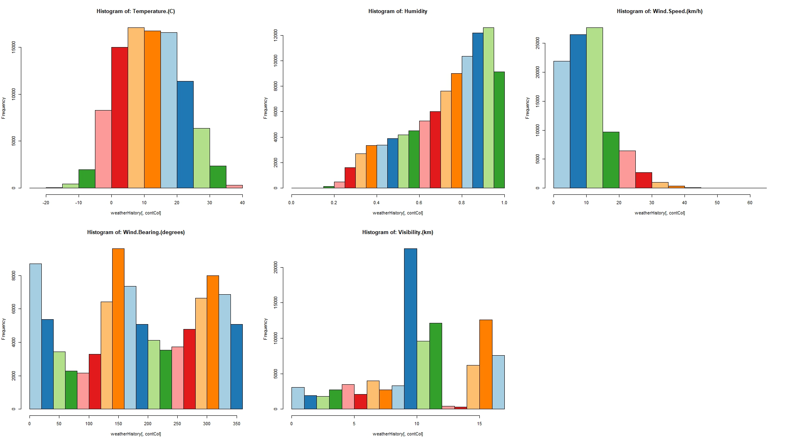
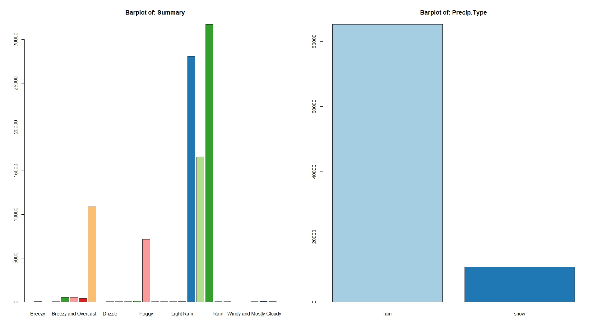

# Weather History Dataset Analysis

## Project Overview
This project involves analyzing factors impacting temperature using a weather history dataset. It includes data preprocessing, visualization, and the development of predictive models using R.

## Dataset
The dataset used for this analysis is sourced from [Kaggel.com](https://www.kaggle.com/datasets/rafunlearnhub/weatherhistory/data).

## Project Steps
1. **Data Cleaning**:
   - Handled missing values.
   - Extracted and transformed date components (day, month, year, hour).

2. **Data Visualization**:
   - Created and  to explore data distributions.
   - Conducted correlation analysis and ANOVA tests.

3. **Feature Engineering**:
   - Mapped categorical variables to numerical values for modeling.

4. **Model Building**:
   - Developed and evaluated Linear Regression and Decision Tree models.

## Technologies Used
- **R**: openxlsx, plyr, party, caTools, RColorBrewer

## How to Run
1. Clone this repository:
   ```sh
   git clone https://github.com/your-username/weather-dataset-analysis.git
   cd weather-dataset-analysis
